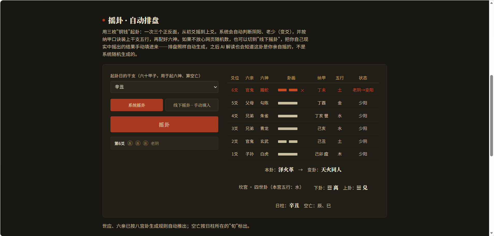
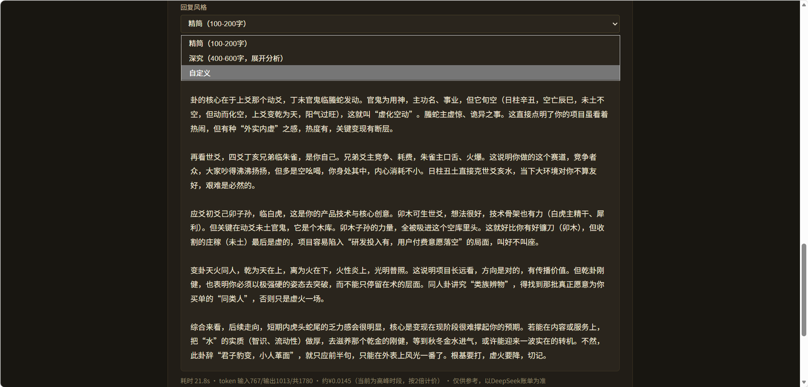
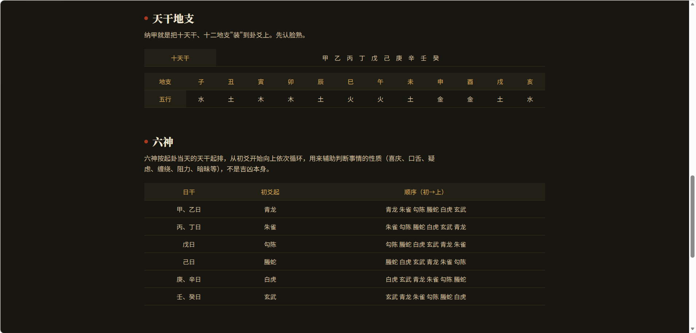

# AI 六爻问卦 · 自动起卦 + DeepSeek 解卦

> 🔮 写下你的问题，点一下——自动起卦排盘、AI 生成白话解读，几秒钟获得一段卦象参考。
> 基于传统火珠林纳甲法，附带从零开始的六爻基础知识教学。
> 网页、安卓、Windows 桌面三端可用，同一套逻辑，随时同步更新。开源免费（MIT）。

## 📸 界面预览

## 🚀 下载 / 使用地址

| 平台             | 地址                                                                     | 说明              |
| -------------- | ---------------------------------------------------------------------- | --------------- |
| 🌐 网页版          | [liuyao.1eak.cool](https://liuyao.1eak.cool)                           | 打开就能用，无需安装      |
| 📱 安卓版          | [Releases 页面](https://github.com/1eakkkk/liuyao-tool/releases)（`.apk`） | 需手动允许"安装未知来源应用" |
| 🖥️ Windows 桌面版 | [Releases 页面](https://github.com/1eakkkk/liuyao-tool/releases)（`.exe`） | 双击安装包，走安装向导     |

> 三端内容同源：网页是"本体"，安卓和桌面版只是套了一层原生窗口/App壳，加载的是同一个网页。**网页内容更新后，安卓和桌面App下次打开会自动显示最新版，不需要重新下载安装。**

> 🌐 网页版打开是"基础知识 / 起卦排盘 / 断卦入门 / AI解卦"四个独立标签页，摇卦和 AI 解读分属两个页面，互不干扰，先摇卦再去 AI 解卦页问。

## ✨ 特点

- **一键问卦**：在"AI解卦"页写下问题、点"AI 解读"，自动摇卦 + 排盘 + 生成解读一步到位，中间没有任何确认弹窗
- **自动起卦排盘**：基于传统火珠林纳甲法，自动计算六亲、六神、世应、纳甲、空亡，无需手动查表
- **一事不问二卦**：内置传统规矩——同一个问题只起一卦，问题没换不允许重摇；换了新问题会自动重新起卦
- **线下摇卦录入**：不信网页随机数？现实中自己摇铜钱，把结果手动填进来照样排盘，AI 也会知道这卦是你亲手摇的
- **日柱自动选中**：打开就是今天的干支，不用自己找
- **回复风格可调**：精简（100-200字）/ 深究（400-600字展开分析）/ 自定义语气与字数，管的是**最终看到的文字长短**
- **推理档位可调**：High（够用、更省）/ Max（最深度思考、token 上限更高），管的是**AI 后台想多深、花多少 token**，跟回复风格是两件事，可以自由组合
- **六爻基础教学**：八卦、五行生克、纳甲、六神、用神速查、旺衰合冲空亡伏神——两个标签页从零讲起
- **本地存储**：API Key 存在你自己设备本地（网页存浏览器，App存App内部），不上传、不经过任何中转服务器
- **一键复制**：解卦结果支持复制，方便分享或保存
- **新手教程**：首次打开自动弹出使用说明，导航栏"?"按钮可随时重看

## 📦 准备工作

使用 AI 解读功能需要一个 **DeepSeek API Key**（用于调用 AI，按使用量计费；只看排盘和教学内容不需要 Key）。

1. 访问 [DeepSeek 平台](https://platform.deepseek.com) 注册/登录
2. 进入 **API Keys** 页面，点击"创建新的 API Key"
3. 复制生成的一长串字符（类似 `sk-xxxxxxxxxxxxxxxx`），**务必先保存到记事本**，关闭页面后不再显示原文

> 💡 API 费用由 DeepSeek 直接向你收取，与本工具无关，也没人能看到你的 Key。

## 🚀 快速开始

不管用哪个平台，操作逻辑都一样：

1. 切到"起卦排盘"页面摇一卦（日柱已经自动选好了，不用管）
2. 切到"AI解卦"页面，点一次"设置"，粘贴你的 DeepSeek API Key，保存（一次性的，以后不用再弄）
3. 需要的话在"设置"里顺手调一下**回复风格**（字数语气）和**推理档位**（High 更省、Max 想得更深），不调就用默认
4. 在输入框**先写下你想问的问题**，比如"最近想跳槽，合不合适"
5. 点"AI 解读"——自动帮你摇卦并生成解读，一步到位
6. 想问下一件事？直接改问题、再点一次就行，会自动重新起一卦

> 按"一事不问二卦"的老规矩：同一个问题只起一卦，问题没换是摇不了第二卦的；短时间内也有频率限制（10 分钟最多 3 卦），心诚则灵。

### 安卓版额外说明

第一次安装非应用商店来源的APK，系统会提示"允许安装未知来源应用"，跟着弹窗提示点过去即可；部分手机会有额外的安全扫描提示，属正常现象，点"仍要安装"继续。安装包的 SHA256 校验值附在每个 Release 的说明里，可自行核对。

### Windows 桌面版额外说明

下载的是安装包，双击后走一遍安装向导（可自选安装路径），装完在开始菜单/桌面能找到图标。

## ⚙️ 配置管理

- **更换 API Key**：网页/App内"AI解卦"页点"设置"→"清除 Key"，重新粘贴一个新Key保存即可
- **Key 存储位置**：网页版存在浏览器本地（`localStorage`），安卓/桌面App存在各自App内部，互不共享、也不会因为切换设备自动同步——换设备需要重新填一次
- **回复风格 / 推理档位**：同样存在本机本地，下次打开自动记住上次的选择

## ❓ 常见问题

**Q: 提示 API Key 无效或调用失败？** 检查：Key 是否完整（开头必须是 `sk-`）、DeepSeek 账户是否有余额、网络是否正常。

**Q: 提示"短时间内已经摇太多次了"？** 内置了 10 分钟最多摇 3 卦的频率限制，计数只存在你自己设备的浏览器里（不是全服共用），稍等一会自动恢复。

**Q: 我的问题会被上传到其他地方吗？** 你的问题、排盘数据仅发送给 DeepSeek 服务器用于生成解卦内容（这是 AI 功能本身必需的），除此之外不会上传到任何第三方。

**Q: 历史记录条数好像变少了/不见了？** 历史记录只在"AI解读"成功之后才会写入一条，纯摇卦、没调用AI、或者调用失败都不会计入；另外它是纯本地存储，不跨设备/浏览器同步，换设备或清了浏览器数据自然就没了。**如果是网页版**，还有一种常见情况：iOS Safari 有个规则，网站超过 7 天没被打开会清空该网站的本地数据（`localStorage`），如果你是把网页直接收藏/加书签打开的，容易碰上这个；把网页"添加到主屏幕"变成独立图标使用可以规避这条限制。

**Q: 三端哪个版本"更新"，需要以哪个为准？** 网页版永远是最新的，因为改动直接发布在网页上；安卓和桌面App只是"窗口壳子"，加载的还是网页内容，所以功能上三端始终保持一致，无需分别对比版本。

**Q: 解卦结果可靠吗？** 六爻属于传统文化中的象数推演，AI 解读仅供文化学习与娱乐参考，**不建议**作为医疗、法律、财务等重大决策的依据。涉及健康、人身安全等问题，请务必咨询专业人士。

## 🕰️ 历史版本说明

项目最早是一个纯 Python 桌面程序（PyInstaller 打包），靠自动化脚本抓取网页数据再调用AI，已被本页面描述的新架构取代（AI解读能力直接内置进网页本身，不再需要外部脚本抓取）。旧版代码仍保留在仓库历史记录中，仅作存档，不再维护。

## 📄 许可证

本项目基于 [MIT License](LICENSE) 开源，免费使用，转发/二次分发请保留原作者署名与许可证文件。

## 🙏 致谢

- 排盘算法与网页基于传统火珠林纳甲体系整理
- AI 能力由 [DeepSeek](https://deepseek.com) 提供
- 安卓/桌面套壳分别基于 [Capacitor](https://capacitorjs.com) 和 [Electron](https://electronjs.org) 构建

## 💬 交流与反馈

- **提 Bug / 功能建议**：优先走 [GitHub Issues](https://github.com/1eakkkk/liuyao-tool/issues)——描述清楚"做了什么操作、期望什么、实际发生什么"，最好带截图
- **易学交流**：可扫码进微信群（二维码定期更新，如已过期请在 Issues 里说一声）

---

**祝您卦卦顺心，事事如意！** 🌟
