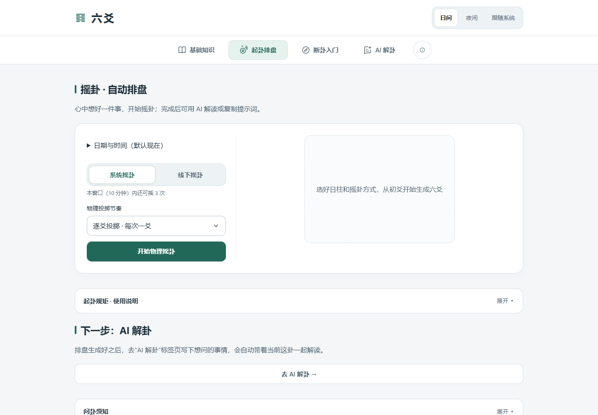
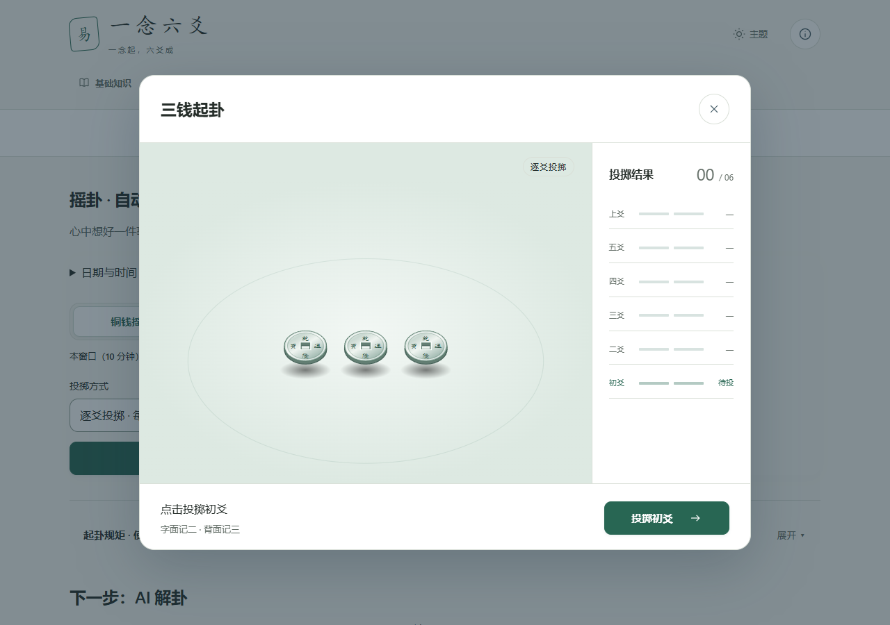
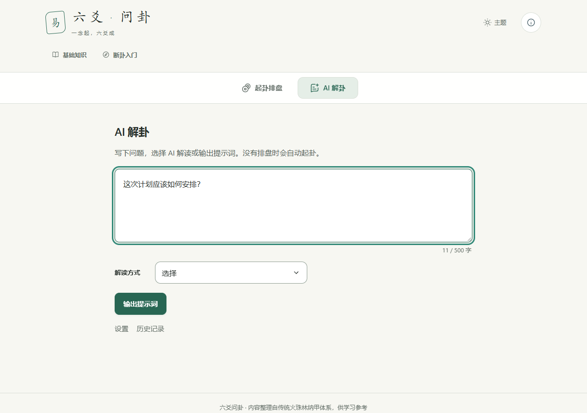
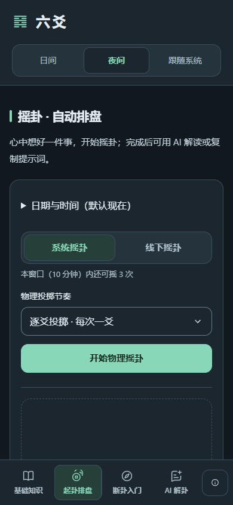
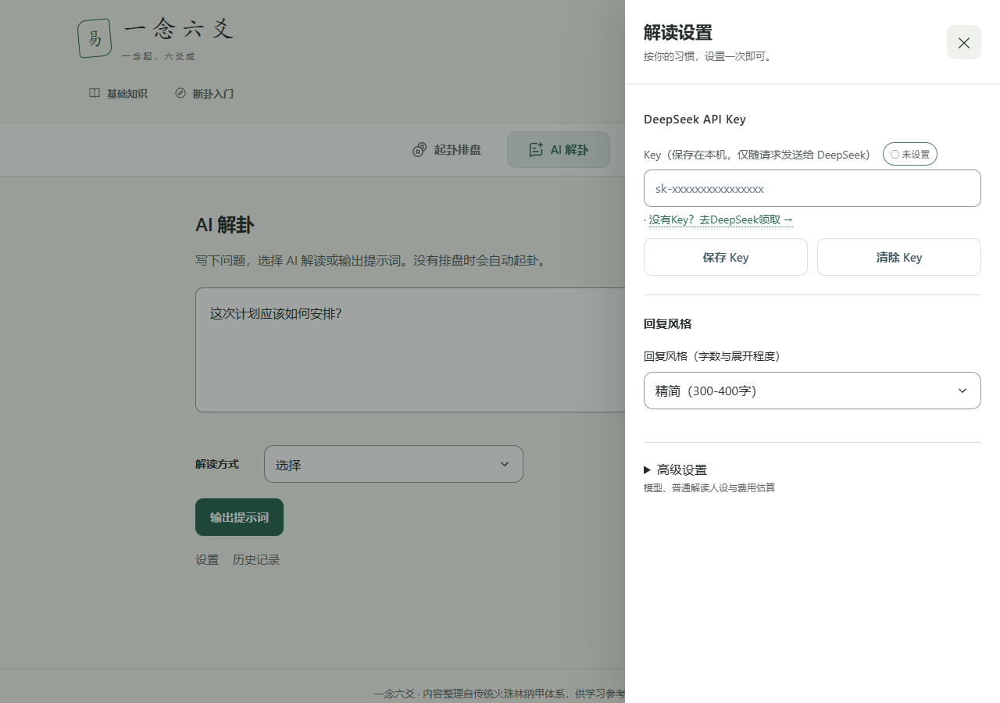
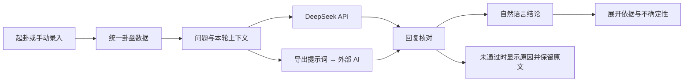
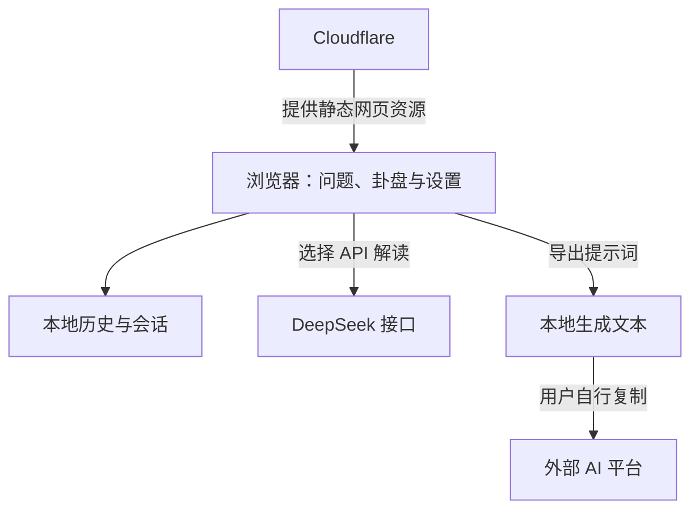

<div align="center">

# 一念六爻

**从三钱起卦、纳甲排盘，到有依据可查的结构化解读。**

一个面向个人与小圈子使用的非盈利工具。纯静态前端，无需注册；支持 DeepSeek API，也可以导出提示词交给外部 AI。

[打开网站](https://gua.1eak.cool/) · [使用方法](#快速开始) · [本地开发](#本地开发) · [反馈问题](https://github.com/1eakkkk/liuyao-tool/issues)


</div>



> 发布状态核对于 **2026-10-04**，已上线刷新／超时返回清空当前卦盘及紧凑解读要求；截图拍摄于 2026-10-01。[本次发布记录](docs/WORKSPACE_RESET_COMPACT.md)。正式地址为 https://gua.1eak.cool/

> 仓库只保留 `main` 工作分支，历史里程碑通过归档标签和 Git 历史保留。知识库增强尚未进入生产。

打开页面默认进入 **起卦排盘**。主导航只有「起卦排盘」「AI 解卦」，学习资料在顶部，主题与帮助位于右上角。无需先读教程，也无需注册。

## 目录

- [可以做什么](#可以做什么)
- [界面预览](#界面预览)
- [快速开始](#快速开始)
- [结构化解读如何工作](#结构化解读如何工作)
- [物理摇卦与快速起卦](#物理摇卦与快速起卦)
- [历史记录与数据存储](#历史记录与数据存储)
- [本地开发](#本地开发)
- [部署到 Cloudflare](#部署到-cloudflare)
- [项目结构与文档](#项目结构与文档)
- [常见问题](#常见问题)
- [参与改进](#参与改进)

## 可以做什么

| 功能 | 说明 |
| --- | --- |
| 三钱物理起卦 | 在浏览器内模拟三枚铜钱的运动、碰撞与落定，支持逐爻投掷或连续六爻 |
| 线下结果录入 | 已经用真实铜钱摇好卦时，可以手动录入六爻并生成排盘 |
| 纳甲排盘 | 展示本卦、变卦、纳甲、六亲、六神、世应、动爻及日期相关信息 |
| DeepSeek 解读 | 使用自己的 API Key 发起解读、继续追问、停止生成 |
| 提示词导出 | 不填 Key 也能导出问题与卦盘；交给外部 AI 后，可贴回结构化回复 |
| 两种解读 | 普通解读以文字呈现；结构化解读先看结论，再按需展开依据、候选与不确定性 |
| 历史记录 | 本机保存问答与排盘摘要；长回复可收起，详情区域可滚动 |
| 入门资料 | 基础知识与断卦入门分别组织，适合边操作边查阅 |
| 主题与移动端 | 日间、夜间、跟随系统；手机导航、统一表单控件与页面过渡 |

网站本身不收费、不提供账号体系，也不代售 AI 服务。选择 API 模式时，模型服务商会按照你的账户使用量计费。

## 界面预览

以下为当前本地生产构建的真实截图，使用干净的浏览器环境拍摄；示例问题仅用于演示，模型请求已拦截，没有付费调用。截图不代表真实 AI 答案或全机型验收。

### 三钱起卦

点击投掷即可开始，无需在手机上长按。每轮显示一爻的落定结果；未稳定平放时会尝试重投。



### AI 解读入口

同一个问题和卦盘，可以选择直接调用 DeepSeek，或输出提示词交给外部 AI。



### 手机与夜间主题

窄屏使用底部导航，表单和卡片随屏幕调整。长历史记录不会无限撑开页面。

<p align="center"></p>

### 设置

常用设置放在独立面板，高级选项按需展开。结构化模式隐藏不适用的人设、推理档位；当前页面的模型选项和费用估算不是服务商价格承诺。



## 快速开始

### 方式一：只摇卦、看排盘

1. 打开 [网站](https://gua.1eak.cool/)，进入「起卦排盘」。
2. 在「铜钱摇卦」中选择逐爻投掷或连续六爻，点击「开始摇卦」。
3. 在投掷窗口点击按钮，完成六爻后查看排盘。
4. 如果已经在线下摇好卦，切换手动录入，按页面爻位填写六次结果。

排盘和教学内容不需要 API Key，也不会产生模型调用费用。重新起卦时请按页面提示确认，避免把同一件事的多次结果混在一起。

### 方式二：使用 DeepSeek API

1. 在「AI 解卦」的设置中填写自己的 DeepSeek API Key。
2. 写清楚所问的事情与必要背景，从「选择」占位中明确选定普通或结构化解读，再设定回复篇幅。
3. 点击「AI 解读」。已有可用卦盘时按页面流程使用；需要起卦时，浏览器会完成起卦再发送请求。
4. 阅读结果；结构化模式可按需展开依据与不确定性。
5. 同一件事可继续追问；换问题时重新建立对应的卦盘和会话。

Key 由你向 [DeepSeek 开放平台](https://platform.deepseek.com/)申请。模型选择以当前页面提供的选项为准；费用以服务商账单为准，页面估算仅供核对。

| 解读方式 | 适合怎样使用 | 返回与检查 |
| --- | --- | --- |
| 普通解读 | 希望直接阅读文字，可选择人设与推理档位 | 自然语言回复，不走结构化 JSON 核对 |
| 结构化解读（试用） | 希望展开依据、核对引用、方便历史回看 | JSON 协议，先展示结论；篇幅和自定义语气进入提示，不使用普通模式的人设与推理档位 |

页面没有默认替你选择解读方式。直接 API 目前只接入 DeepSeek；其他 AI 可通过导出提示词使用，这不等于本站已接入 OpenAI、Anthropic 等接口。

### 方式三：导出提示词，不填 Key

普通模式可导出文字提示词，结构化模式可导出 JSON 要求并贴回核对。以下以结构化模式为例：

1. 写下问题并准备卦盘，选择结构化解读，点击「输出提示词」。
2. 复制生成的完整提示词，粘贴到你使用的外部 AI。
3. 等待外部 AI 完成，复制其完整 JSON 回复。
4. 返回本站，贴入回复并勾选已复制完整内容，再点击「核对并显示解读」。
5. 继续追问时，使用「输出追问提示词」生成与当前问答对应的新提示词。

本站生成、核对提示词本身不调用付费接口。外部 AI 是否收费、如何处理输入，由你选择的平台决定。请保留完整结构，不要只复制其中的自然语言结论。

## 结构化解读如何工作

结构化解读把卦盘事实、模型解释和不确定性分开呈现，方便回看与核对。


```mermaid
flowchart LR
    A[起卦或手动录入] --> B[统一卦盘数据]
    B --> C[问题与本轮上下文]
    C --> D[DeepSeek API]
    C --> E[导出提示词 → 外部 AI]
    D --> F[回复核对]
    E --> F
    F --> G[自然语言结论]
    G --> H[展开依据与不确定性]
    F --> I[未通过时显示原因并保留原文]
```

### 当前会检查什么

- 回复结构是否完整、必要字段与引用是否存在。
- 回复是否属于当前卦盘和问答轮次，避免把另一轮结果贴回来。
- 部分明确的「某爻为动爻／静爻」陈述是否与本卦事实冲突。
- 程序事实与规则标注分开显示，规则可展开查看来源事实。

### 当前不会保证什么

**格式与引用检查通过，不等于解释正确，也不等于预测可靠。** 动静核对只覆盖有限的明确表达，不是完整自然语言事实审查；象意推论、回答是否充分和现实结果仍需要人工判断。

新版会话采用 `reading-production-4`：校验失败的原文保留在本地，但不继续带入后续追问。旧版历史仍可查看，格式兼容；当前页面不再自动恢复旧会话。新建解读增加紧凑要求，API 与导出提示词一致。

长结论支持展开／收起；依据默认收起，同一分析段内的事实去重，规则关联本段事实编号。复制使用完整内容，页面收起不删减保存内容。生成追问时保留当前轮次的阅读展开状态。

回复篇幅是生成目标，不保证精确字数。结构化模式支持篇幅与自定义语气，不沿用不适用的人设、推理档位设置。没有依据时应说明不确定性，而不是为了达到字数补造内容。

## 物理摇卦与快速起卦

**AI 页的快速起卦也运行物理模拟。** 它和可见的摇卦窗口共用物理世界创建与落定判定逻辑。

| 对比 | 手动点击物理摇卦 | AI 页面快速起卦 |
| --- | --- | --- |
| 结果来源 | 铜钱模型落定后的朝向 | 铜钱模型落定后的朝向 |
| 过程 | 随动画逐步播放，可逐爻投掷 | 连续计算六爻，不等待完整动画播放 |
| 为什么速度不同 | 等待画面播放、落定和下一轮操作 | 按批次推进模拟，省去可视化等待 |
| 执行位置 | 本机浏览器 | 本机浏览器 |

点击时间、位置等参与初始化运动状态；两种入口的初始条件不完全相同，因此不要求结果一致。判定结果时没有直接随机抽取卦象，也没有由 AI 决定卦象。

这是软件物理模拟，不是通过手机传感器识别真实铜钱，也不意味着模拟分布已经被证明等同于现实投币。

## 历史记录与数据存储

- 历史记录、设置及已保存的 Key 位于当前浏览器的本地存储，不跨设备自动同步。点击保存后的 Key 以明文写入 `localStorage`，输入框打码仅用于显示，不是加密。
- 刷新或重新进入网页时，问题输入框清空，解读方式回到「选择」；当前卦盘、输出和追问也会清空；离开页面满 30 分钟返回时同样重置。短暂切到其他应用保留当前内容，已保存历史、设置与起卦次数不受影响。
- 历史列表最多保留 **200 条**；最近一次结构化会话最多 **8 轮**，刷新后到历史记录中查看，当前页面从新的一卦开始。
- 结构化 API 解读与提示词路径都会记录对应状态；只导出提示词不代表已经获得 AI 答案。
- 超过 **300 字**的历史问答默认收起，可展开全文；单条记录详情限制高度并可内部滚动。
- 复制结构化对话包含折叠的依据与不确定性；删除记录需要确认。
- 清理浏览器数据、更换浏览器、使用无痕窗口或浏览器存储回收，可能使本机记录不可用。重要内容请及时复制留存。


```mermaid
flowchart TD
    A[浏览器：问题、卦盘与设置] --> B[本地历史与会话]
    A -->|选择 API 解读| C[DeepSeek 接口]
    A -->|导出提示词| D[本地生成文本]
    D -->|用户自行复制| E[外部 AI 平台]
    F[Cloudflare] -->|提供静态网页资源| A
```

项目没有自建业务后端。API 模式下，Key 用于向 DeepSeek 鉴权，问题、卦盘及必要上下文会发送给 DeepSeek；这不代表 Key 永远不会离开设备。不要在共享设备保存 Key，也不要把 Key、私人问题或完整个人历史提交到 Issues。

## 本地开发

### 环境

- Node.js **24.15 或更高**；仓库 CI 使用 24.18.0。
- npm，以及 Git。
- 当前浏览器回归以 Windows + Microsoft Edge 为主，部分脚本也使用 Playwright WebKit。

### 启动当前网站源码

```sh
git clone --branch main https://github.com/1eakkkk/liuyao-tool.git
cd liuyao-tool
npm ci
npm run dev
```

打开终端输出的本地地址。源码使用 Vite 与原生 ES Modules，请通过开发服务器访问，不要直接双击源码 `index.html`。

### 构建与检查

```sh
# 单元与回归测试（与 CI 一致，冻结验收要求已跟踪修改先提交）
npm test -- --maxWorkers=1

# 构建，并检查生产资源边界及生成资产清单
npm run release:check

# 本地预览 dist
npm run preview
```

浏览器检查需先完成构建，脚本会启动自己的预览服务：

```sh
npm run test:browser
npm run test:browser:reading
npx playwright install webkit
npm run test:browser:usability
npm run test:browser:controls
```

完整检查列表见当前源码分支的 [GitHub Actions 工作流](https://github.com/1eakkkk/liuyao-tool/blob/main/.github/workflows/verify.yml)。部分脚本固定使用 Edge，不应假设所有脚本都能在未安装 Edge 的系统上直接运行。

自动化界面测试主要使用模拟 API，不等同于真实模型验收。真实 DeepSeek 测试单独管理 Key、调用预算与结果记录，不是启动或构建网站的必需步骤。

README 截图可以在构建后重新生成，脚本使用干净存储并拦截模型请求，需要本机安装 Edge：

```sh
node scripts/capture-readme.js
```

## 部署到 Cloudflare

当前生产使用 **Cloudflare Workers Static Assets**，提供纯静态网站，不是 Cloudflare Pages，也没有业务 API 后端入口。

| 项目 | 当前配置 |
| --- | --- |
| Worker 名称 | `liuyao` |
| 正式域名 | `gua.1eak.cool` |
| 配置文件 | `wrangler.jsonc` |
| 构建输出 | `dist/` |
| 构建命令 | `npm run release:check` |

自行部署时，先将 `wrangler.jsonc` 中的名称改为自己的 Worker 名称，并在自己的 Cloudflare 账户配置域名。不要在前端构建变量中放入共享 API Key，静态资源中的密钥会暴露给访问者。

```sh
npm ci
npm run release:check
npx wrangler login

# 检查配置与打包结果，不发布
npx wrangler deploy --dry-run

# 确认账户、Worker 名称和资源后发布
npx wrangler deploy
```

仓库的 Verify 工作流负责测试，不能把检查成功当作已经部署。发布后应核对线上资源、手机布局、起卦、提示词和历史恢复；保留上一版本用于回滚。版本发布与回滚记录见下方文档入口。

## 项目结构与文档

以下路径以当前网站源码分支为准：

```text
src/
├─ app/          页面事件与起卦状态
├─ core/         排盘、归一化数据与物理模拟
├─ ai/           AI 请求与解读逻辑
│  └─ output/    结构化协议、上下文、核对与展示
├─ storage/      本地设置、会话、历史与迁移
├─ ui/           页面组件、历史及物理投掷窗口
└─ styles/       主题、布局与响应式样式
scripts/         发布检查、浏览器回归及专项评估
tests/           单元测试、回归样例与冻结基线
docs/            方案、阶段进度与验收记录
experiments/     离线实验及版本封存，不随稳定站点发布
knowledge/       文献、现代整理和历史语料版本，不自动注入生产
public/          随站点发布的静态资源
index.html       网页入口
wrangler.jsonc   Cloudflare 静态资源配置
```

| 文档 | 内容 |
| --- | --- |
| [项目状态与路线](https://github.com/1eakkkk/liuyao-tool/blob/main/docs/PROJECT_STATUS.md) | 各 Phase 的真实进度、已完成与未完成事项 |
| [架构说明](https://github.com/1eakkkk/liuyao-tool/blob/main/docs/ARCHITECTURE.md) | 模块组织与演进背景 |
| [迁移映射](docs/MIGRATION_MAP.md) | 旧单文件逻辑与当前模块的对应关系 |
| [文档导航](docs/DOCUMENTATION.md) | 当前入口、历史阶段和实验文档的阅读顺序 |
| [数据结构](https://github.com/1eakkkk/liuyao-tool/blob/main/docs/DATA_SCHEMA.md) | 卦盘数据与迁移约定 |
| [结构化输出](https://github.com/1eakkkk/liuyao-tool/blob/main/docs/STRUCTURED_OUTPUT.md) | 输出协议与校验设计 |
| [结构化解读 v3](https://github.com/1eakkkk/liuyao-tool/blob/main/docs/STRUCTURED_READING_V3.md) | 新版行为、真实测试发现与发布验收 |
| [生产范围](https://github.com/1eakkkk/liuyao-tool/blob/main/docs/PRODUCTION_PLAN.md) | 稳定版与实验功能边界 |
| [验收资料](https://github.com/1eakkkk/liuyao-tool/tree/main/docs/acceptance) | 各次发布的检查报告 |
| [知识候选真实试测](docs/SOURCED_READING_LIVE_PILOT.md) | 两次真实接口调用、独立审查与预算边界 |
| [整理后的真实对照](docs/CLARITY_LIVE_EVALUATION.md) | 四次月合／旬空测试，保留支持与出处问题；尚未满足知识上线验收 |
| [术语与出处候选](docs/SOURCED_CLARITY_CANDIDATE.md) | 新提示与评价准备，尚不证明模型已改善 |
| [程序出处绑定候选](docs/BOUND_SOURCE_CANDIDATE.md) | 程序保存完整引文与出处、模型声明实际引用；仅离线，语义尚未验收 |
| [单条真实引用检查](docs/BOUND_LIVE_EVALUATION.md) | 两名独立审查通过一条月合回答；不代表总体改善或知识可上线 |
| [判断主次修正](docs/JUDGMENT_CORRECTION.md) | 修正月令摘要，要求新结构化回答说明取用与主次；真实效果仍需验证 |
| [判断真实复测](docs/JUDGMENT_LIVE_REVIEW.md) | 两条 production4 回答未通过内容验收，保留逐字审查、原始回复及预算核清记录 |
| [精简判断候选复测](docs/JUDGMENT_COMPACT_REVIEW.md) | 独立冻结两次开发调用；引用与主次问题仍在，候选未上线 |
| [事实与解释分离 v2](docs/EVIDENCE_LED_LIVE_REVIEW.md) | 六例真实开发检查、费用和双人审查；结构五例通过、一例拒绝，内容仍未通过，尚未发布 |
| [关键取用来源候选](docs/JUDGMENT_FOCUS_SOURCE_CANDIDATE.md) | 三条已有原典摘录及扫描复核，完整适用条件尚未准入知识库 |
| [任务分流开发](docs/TASK_LED_REVIEW.md) | 事实核对由程序生成、一般建议不发送卦盘、趋势单独解释，隔离实验尚未上线 |
| [趋势引用包开发](docs/PACKET_LED_REVIEW.md) | 程序展开来源及参与者；首例真实检查被拒绝并停止，主次单选候选仅离线验收，尚未上线 |
| [局部依据与解释拆分](docs/PACKET_LOCAL_REVIEW.md) | 只展开所选事实及规则来源，问题解释与现实建议分开；离线候选，内容仍需真实验收 |
| [局部依据真实开发检查](docs/PACKET_LOCAL_LIVE_REVIEW.md) | 单例真实回复被拒绝；编号混用、覆盖缺漏和混合主次问题保留，尚未上线 |
| [事实与解释分离原型](docs/EVIDENCE_LED_OFFLINE.md) | 程序展示事实，单独记录主要取用与取舍；只离线验收，未接入正式解读 |

阶段文档保留了当时的上下文，历史的「未发布」结论不应直接当作当前状态。请结合项目状态和对应版本的发布记录阅读。

根目录 `README.md` 是唯一项目使用说明；实验目录里的 README 解释各自的冻结版本，不是另一份网站说明。旧宣传截图归档在 `docs/archive/legacy-screenshots/`。付费实验记录、预算账本和 Key 不应提交；验收目录只保留经过检查的公开资料。直接删除本机 `test-results/` 可能丢失费用预留与防重跑记录。

## 常见问题

<details>
<summary><b>没有 API Key 可以使用吗？</b></summary>

可以。起卦、排盘、学习资料和提示词导出不要求 Key。只有本站直接调用 DeepSeek 时需要你的 Key。

</details>

<details>
<summary><b>为什么解读显示 700–800 字，实际却短很多？</b></summary>

篇幅设置会进入结构化提示词，但它是目标，不是硬性字数保证。简短问题、依据不足或模型未遵循要求都可能使结果偏短。可以围绕遗漏的具体问题追问，不建议仅为了凑字数反复生成。

</details>

<details>
<summary><b>为什么贴回回复后没有正常展示？</b></summary>

确认复制了当前这一轮的完整 JSON，而非部分结论或另一轮回复。页面会区分不完整、格式、引用、轮次和部分事实冲突等原因，并保留原文。通过结构检查也不代表所有解释均正确。

</details>

<details>
<summary><b>为什么提示暂时不能继续摇卦？</b></summary>

当前设有本机 10 分钟最多 3 次的起卦限制，页面会提示可用次数。取消或未完成的物理起卦不会按成功起卦计数。同一件事建议保留原卦继续追问。

</details>

<details>
<summary><b>手机摇卦是不是要长按？铜钱立住怎么办？</b></summary>

当前操作是点击投掷，无需长按。铜钱未稳定平放时会自动尝试重投；达到重试次数仍未落定时，按提示再投。反馈问题时请附机型、浏览器、系统版本与具体操作。

</details>

<details>
<summary><b>安卓或 Windows 安装包还适用吗？</b></summary>

仓库 [Releases](https://github.com/1eakkkk/liuyao-tool/releases) 可能保留历史安装包。当前维护与本文验收范围以网页为准，不能根据网页更新推断旧版 App 壳的兼容性；建议优先使用浏览器访问正式域名。

</details>

<details>
<summary><b>知识库增强已经上线了吗？</b></summary>

尚未上线自动注入。稳定版的结构化协议、程序事实和规则标注，与实验中的知识库增强不是同一件事。研究代码或 Phase 文档存在，不表示相应功能已经通过生产验收。

</details>

## 参与改进

欢迎通过 [Issues](https://github.com/1eakkkk/liuyao-tool/issues) 提交问题，尽量提供：

1. 使用的设备、浏览器与系统版本。
2. 从打开页面开始的复现步骤。
3. 期望行为与实际结果。
4. 已脱敏的截图或错误提示；不要附 API Key。

涉及排盘规则或解读依据的修改，建议同时提供可核对的案例与出处；涉及界面的修改，请覆盖桌面和手机尺寸。普通网页检查无需调用付费模型。

## 许可证与致谢

本项目采用 [MIT License](LICENSE)。复制与再分发请保留许可证和版权声明。

感谢 Vite、Cannon.js、Playwright 等开源项目，以及提供模型接口的 DeepSeek 和静态托管服务 Cloudflare。

六爻相关内容用于传统文化学习与交流。AI 输出包含不确定性，不应视为现实结果的保证。
